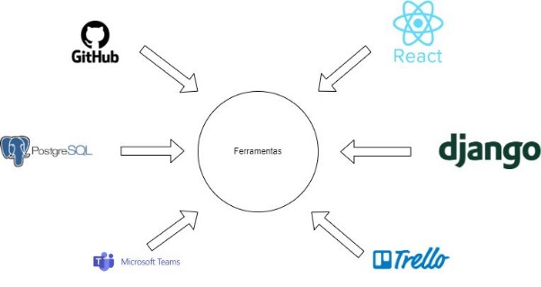
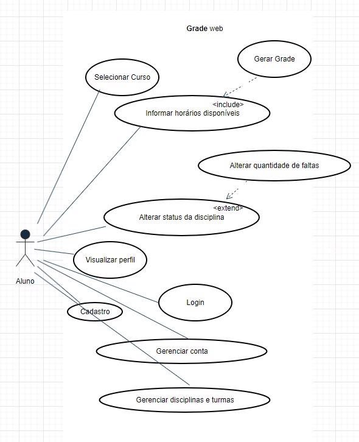

**Declaração de Escopo do Produto**

Versão [1.3]

**Histórico de Revisão**

|**Data**|**Versão**|**Descrição**|**Autor(es)**|
| - | - | - | - |
|**23/10/2023**|1\.0|Criação do documento Declaração de escopo do produto.|Equipe Kepler|
|**10/11/2023**|1\.1|Correção do documento Declaração de escopo do produto de acordo com recomendações do professor.|Equipe Kepler|
|**22/11/2023**|1\.2|Correção nas sprints previstas e tecnologias usadas.|Johnny da Ponte|
|**30/11/2023**|1\.3|Correção no diagrama de caso de uso.|Johnny da Ponte|

**1 Problema / Sistema de software**

➔ ***Definição da equipe**:*

|**Papel**|**Responsável**|
| - | - |
|Front-end|Gabriel Fenelon Igor de Souza|
|Back-end|Gustavo Alves Vitor Gabriel|
|Banco de dados|Johnny da ponte Vitor Bessa|

➔ **Resumo do problema:** O problema central identificado é a falta de uma ferramenta de gerenciamento acadêmico que personalize e gere uma grade para os estudantes da FGA. Atualmente, os estudantes precisam lidar manualmente com o processo de matrícula em disciplinas e o acompanhamento de seu progresso acadêmico. Isso resulta em:
- Ineficiência na Matrícula: Os estudantes muitas vezes têm dificuldade em encontrar disciplinas compatíveis com seus horários e suas necessidades curriculares.

-  Desconhecimento do Progresso: O acompanhamento do progresso acadêmico,incluindo disciplinas concluídas e horas concluídas, é desafiador e propenso a erros.

➔ **Sistema de Software.** Para abordar esse problema, propomos o desenvolvimento de um Sistema de Gerenciamento Acadêmico específico para a FGA. Essa solução de software será uma plataforma completa que oferecerá as seguintes funcionalidades:

- Gerador de grade: O sistema fornecerá sugestões de disciplinas com base no curso escolhido pelo estudante, evitando conflitos de horários e garantindo uma grade mais eficiente.
- Progresso de grade: Os estudantes poderão acompanhar facilmente seu progresso acadêmico, visualizando as disciplinas concluídas
- Gerenciador de Falta: Os estudantes poderão acompanhar a frequência das faltas de forma manual.

***Resumo de tecnologias usadas:***

|***Área***|***Tecnologia***|
| - | - |
|Front-end|React|
|Back-end|Django|
|Banco de dados|PostgreSQL|
|Controle de versão|Github|
|Comunicação|Microsoft Teams|
|Gestão|Trello|

➔ **Motivos das tecnologias usadas:**

    React: Rápido, flexível e fácil de usar e aprender.
    Django: Rápido, Conteúdo diverso e familiaridade da equipe. 
    PostgreSQL: Fácil integração.
    GitHub: Conteúdo diverso, Armazenamento e proteção de dados. 
    Teams: Comunicação e familiaridade da equipe
    Trello: Tarefas e organizações semanais.

➔ **Resumo da metodologia de desenvolvimento usada:** A metodologia Ágil, com foco em Scrum e o uso da metodologia XP foram adotadas para permitir uma resposta ágil às mudanças nas necessidades acadêmicas e aos feedbacks dos estudantes e para ter uma melhora na performance da equipe ao utilizar das práticas do XP.

➔ **Outras informações sobre o ciclo de vida:**
- **Métodos, técnicas:**
- - Scrum Master: Um membro da equipe Scrum que atua como facilitador e ajuda a equipe a seguir as práticas do Scrum.

- - Programação em Pares: Dois desenvolvedores trabalham juntos em uma única tarefa. Promove a revisão contínua do código, resolução de problemas e compartilhamento de conhecimento.

- - Sprints: O desenvolvimento é dividido em iterações de curta duração, geralmente de 1 semana cada . As Sprint tem um objetivo claro e um incremento entregável e isso ajuda na gestão do projeto e adaptação às mudanças

- - Product Backlog: Uma lista priorizada de todos os requisitos do projeto.

- - Integração Contínua: As alterações no código são integradas continuamente ao repositório principal, permitindo a detecção precoce de conflitos e a manutenção de um código sempre funcional.

- - Programação em Pares: Os desenvolvedores trabalham em pares, onde um escreve o código enquanto o outro revisa. Isso promove a colaboração, compartilhamento de conhecimento e melhoria da qualidade do código.

- - Padronização do código: Ao adotar práticas de padronização de código, a equipe na XP fortalece sua coesão, favorece a eficiência colaborativa e sustenta a manutenção de um código fonte que é coeso e claro, mesmo quando produzido por diversos membros da equipe.

- **Métricas usadas no desenvolvimento**: 

As métricas de teste incluem:
1. Cobertura de Código: Mede a porcentagem de código testado.
1. Taxa de Falhas por Sprint: Registra o número de falhas encontradas em cada Sprint.
- **Testes de software:**

A abordagem de testes adotada é baseada na metodologia ágil. Os níveis de teste incluem:

1. Testes Unitários: Realizados pelos desenvolvedores para garantir que partes individuais do código funcionem conforme o esperado.
1. Testes de Integração: Testam a integração entre diferentes módulos ou componentes.

Todas as evidências de execução de testes, métricas e resultados serão registradas e atualizadas no repositório do projeto no Github, garantindo a transparência e rastreabilidade.

**2 Backlog do produto**

2.1 **Perfis**

|#|Nome do perfil|Características do perfil|Permissões de acesso|
| - | - | - | - |
|1|Aluno|Estudante da instituição com acesso a informações acadêmicas. Pode visualizar faltas, horários de aula e informações sobre cursos e disciplinas.|
- Visualizar faltas. -

Acessar informações sobre cursos e disciplinas. - Verificar horários de aula. - Acessar informações pessoais.
|

2. **Cenários**

|Sistema: GradeWeb – Cenários funcionais|||
| - | :- | :- |
|Numeração do cenário|Nome do cenário|Sprints|
|1|Cadastro de Usuários|Sprint 1|
|2|Autenticação de Usuários|Sprint 2|
|3|Gerenciamento de Cursos|Sprint 3|
|4|Inscrição em Disciplinas|Sprint 4|
|5|Visualização de Faltas|Sprint 5|
|6|Acesso a Informações de Cursos|Sprint 6|
|7|Configurações do Perfil do Administrador|Sprint 7|
|8|Atualização de Informações Pessoais (Aluno)|Sprint 8|

3.**Backlog do produto**

**Sistema: GradeWeb – Backlog do produto**

|
Numeração

(Cenário / requisito)
|Sprint|Nome do requisito|
Tripo de requisito

(Funcional / não funcional)
|Priorização do requisito Must, Should, Could|Descrição sucinta do requisito|**User histories (U.S.) associadas** Identifique as U.S. associadas ao requisito|
| - | :- | :- | :- | :- | :- | :- |
|1|1|Cadastro de usuário|Funcional|Must|Permite o cadastro de novos usuários no sistema.|US-001, US-002|
|2|2|Autenticação de Usuários|Funcional|Must|Permite que os usuários autentiquem-se no sistema.|US-003, US-004|
|3|3|Gerenciamento de curso|Funcional|Must|Permite a escolha de curso.|US-005, US-006|
|4|4|Alterar status da Disciplinas|Funcional|Must|Permite que os alunos alterem o status das disciplinas.|US-007, US-008|
|5|5|Visualização de Faltas|Funcional|Must|
Permite aos alunos visualizarem e atualizarem

as faltas.
|US-009|
|6|6|Acesso a Informações de Cursos|Funcional|Must|Permite acessar informações de cursos e disciplinas.|US-010|
|7|7|Configurações do Perfil do Administrador|Funcional|Should|
Permite ao administrador configurar perfis de

usuários.
|US-011, US-012|
|8|8|Atualização de Informações Pessoais (Aluno)|Funcional|Must|Permite aos alunos atualizarem informações pessoais.|US-013, US-014|

4.**Sprints previstas**

Sistema: GradeWeb – Sprints previstas

|# Sprint|Descrição|Objetivos|Composição de itens do backlog (Lista conforme tabela Backlog do produto)|
| - | :- | :- | :- |
|1|
Aprimeira sprint visa implementar o registro de novos usuários, um passo crucial para assegurar a funcionalidade básica do sistema, possibilitando que novos estudantes se cadastrem e utilizem a plataforma.
|Implementação do procedimento de registro de novos usuários no sistema.|Cadastro de usuário|
|2|Asegunda sprint implementa a verificação de credenciais de acesso para garantir a segurança do sistema e a autenticação confiável dos usuários.|Implementar a verificação de credenciais de acesso.|Autenticação de Usuários|
|3|A terceira sprint visa capacitar os estudantes a escolher o curso conforme suas preferências, promovendo a autonomia dos usuários na personalização de sua grade curricular de acordo com seu curso..|Habilitar a seleção do curso pelos estudantes.|Gerenciamento de Curso|
|4|A quarta sprint visa implementar a funcionalidade que permite aos estudantes marcar as disciplinas já concluídas. Isso oferecerá aos usuários uma visão organizada de seu progresso acadêmico.|Implementar a marcação de disciplinas já realizadas.|Inscrição em Disciplinas|
|5|A quinta sprint concentra-se no desenvolvimento da funcionalidade que permite aos estudantes visualizar detalhes das disciplinas, com ênfase nas faltas registradas. Isso oferecerá aos usuários uma visão atualizada e clara de sua frequência acadêmica.|Desenvolver a funcionalidade de visualização de faltas nas disciplinas.|Visualização de Faltas|
|6|A sexta sprint visa implementar a funcionalidade que permite aos usuários acessar detalhes sobre os cursos e disciplinas oferecidos. Isso proporcionará aos estudantes uma visão completa das opções disponíveis, auxiliando na tomada de decisões sobre a grade curricular.|Permite acessar informações de cursos e disciplinas.|Acesso a Informações de Cursos|
|7|A sétima sprint foca no desenvolvimento de configurações exclusivas para administradores, proporcionando a eles controle avançado sobre funcionalidades e permissões do sistema. Isso amplia a capacidade dos administradores de personalizar o sistema de acordo com as necessidades específicas.|Desenvolver configurações específicas para administradores do sistema|Configurações do Perfil do Administrador|
|8|A oitava sprint foca na implementação da funcionalidade que permite aos alunos atualizarem suas informações pessoais de forma independente. Isso dá aos usuários a capacidade de manter seus dados atualizados de maneira autônoma.|Implementar a capacidade dos alunos atualizarem suas informações|Atualização de Informações Pessoais (Aluno)|

**3 Definição de Ready /Done Definição de Ready (DoR):**

Descrição Completa: A user story deve ter uma descrição clara e completa que descreve o que precisa ser feito e o motivo.

Critérios de Aceitação Claros: Todos os critérios de aceitação devem estar especificados e compreensíveis.

Priorização de Requisitos: O requisito deve estar devidamente priorizado como Must, Should ou Could.

Estimativa de Complexidade: A user story deve ter uma estimativa de complexidade, como pontos de história ou outra unidade de medida de esforço.

Dependências Identificadas: Todas as dependências devem ser identificadas, e se possível, tratadas antes do início da sprint.

**Definição de Done (DoD):**

Critérios de Aceitação Satisfeitos: Todos os critérios de aceitação da user story devem ser atendidos.

Testes de Aceitação Passados: Todas as funcionalidades relacionadas à user story devem passar nos testes de aceitação.

Code Review Concluído: O código relacionado à user story deve ter passado por uma revisão de código.

Documentação Atualizada: Toda a documentação relevante deve estar atualizada, incluindo documentação técnica, se aplicável.

Integração Contínua/Entrega Contínua (CI/CD): A user stories deve ser integrada ao sistema de forma contínua e pronta para entrega.

Sem Defeitos Conhecidos: Não deve haver defeitos conhecidos relacionados à user story. 

**4 US – User Histories**

**Requisito 1: Cadastro de Usuário**

**US-001:** Como um novo usuário, eu quero poder preencher um formulário com meu nome, e-mail, senha e curso para criar uma conta no sistema.

**US-002:** Como um novo usuário, eu quero receber uma confirmação de que minha conta foi criada com sucesso e está automaticamente logado no sistema após o cadastro.

**Requisito 2: Autenticação de Usuários**

**US-003:** Como um usuário registrado, eu quero ser capaz de inserir meu nome de usuário (e-mail) e senha na tela de login para ter acesso ao sistema.

**US-004:** Como um usuário registrado, eu quero receber uma mensagem de erro se inserir credenciais inválidas durante o processo de autenticação.

**Requisito 3: Gerenciamento de Disciplinas**

**US-005:** Como administrador, eu quero ter a capacidade de adicionar, editar e excluir disciplinas, para manter a lista de cursos atualizada.

**US-006:** Como um administrador, eu quero ser notificado sobre qualquer ação de edição ou exclusão de um curso, para garantir a precisão das informações.

**Requisito 4: Inscrição em Disciplinas**

**US-007:** Como aluno, eu quero ser capaz de visualizar uma lista de disciplinas disponíveis para matrícula com base nas informações fornecidas.

**US-008:** Como um aluno, eu quero receber uma confirmação de que qualquer alteração no status de uma disciplina foi bem-sucedida.

**Requisito 5: Visualização de Faltas**

**US-009:** Como aluno, eu quero ser capaz de visualizar e atualizar faltas para cada disciplina em que está com o status “Cursando”.

**Requisito 6: Acesso a Informações de Cursos**

**US-010:** Como aluno, eu quero ser capaz de acessar informações detalhadas sobre os cursos oferecidos e as disciplinas incluídas em cada curso.

**Requisito 7: Configurações do Perfil do Administrador**

**US-011:** Como um administrador, eu quero poder configurar diferentes tipos de perfis de usuários, como Administrador diferentes níveis de acesso e permissões.

**US-012:** Como um administrador, eu quero poder editar as configurações de perfil dos usuários, se necessário.

**Requisito 8: Atualização de Informações Pessoais**

**US-013:** Como um aluno, eu quero poder atualizar minhas informações pessoais, como endereço, número de telefone, etc.

**US-014:** Como um aluno, eu quero receber uma confirmação de que minhas informações pessoais foram atualizadas com sucesso.

**5 Diagrama de casos de uso**

**6 MVP**

O GradeWeb é uma aplicação web cujo principal objetivo é fornecer uma grade personalizada para os alunos da FGA, considerando critérios estabelecidos por cada usuário. Este software abrange funcionalidades cruciais que permitem aos estudantes realizar o seguinte:

- **Cadastro e Autenticação**: Os alunos podem se cadastrar e fazer login de forma segura, garantindo a proteção de suas informações pessoais.
- **Atualização do Status das Disciplinas:** Os alunos podem atualizar o status de suas disciplinas, indicando se já as concluíram com êxito, se estão atualmente matriculados ou se ainda não cursaram a disciplina.
- **Acompanhamento do Progresso Acadêmico:** Os alunos têm à disposição uma ferramenta que lhes permite acompanhar seu progresso acadêmico, visualizando as disciplinas já finalizadas e aquelas que ainda precisam ser cursadas.
- **Gerador de Grades:** O sistema inclui um gerador de grades que com base em informações fornecidas pelo aluno, como sua disponibilidade de horários e as disciplinas já concluídas, irá gerar uma grade com opções de disciplinas disponíveis para o aluno realizar a matrícula.
- **Gerenciador de faltas:** Os alunos poderão realizar o acompanhamento e atualização de suas faltas nas disciplinas que estejam cursando.

Este Gerenciador Acadêmico é uma ferramenta valiosa que permite aos estudantes da FGA planejar e gerenciar seus horários de forma eficiente, levando em consideração suas preferências e necessidades individuais.

**7 Referências**

BOOCH, G. et al. **UML guia do usuario**. [s.l.] Rio De Janeiro Elsevier Campus, 2006. SCRUM.ORG. **Home**. Disponível em: <https://www.scrum.org/>.
