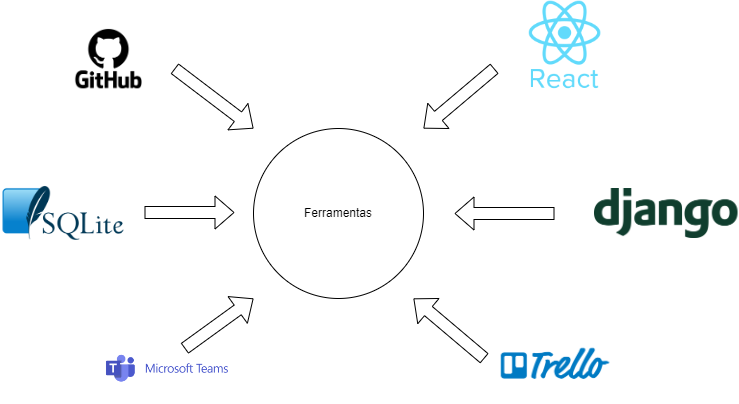

 **VISÃO DO PRODUTO E DO PROJETO**
 
 Versão [1.1]

 **Histórico de Revisão**

|  **Data** | **Versão** |  **Descrição** |  **Autor** |
| ---------- | ---------- | --------------- | ----------- |
|    **02/10/2023**   | 1.0 |  Criação do Documento  |  Equipe Kepler |
|  **10/11/2023**     |  1.1 | Correção do documento de acorod com orientações do professor   | Equipe Kepler |

**VISÃO DO PRODUTO E PROJETO**

Software para gestão de grade com a possibilidade de colocar o curso
 que o estudante faz da FGA, com tela de LOGIN contendo: usuário e
 senha. O programa fará sugestão de matérias correspondentes ao curso
 escolhido, definidos por: nome da disciplina, professor, horário e
 quantidade de horas. Através dela, o usuário pode definir os horários
 em que está disponível e o software irá sugerir matérias que preenchem
 esses horários. O estudante fará o acompanhamento das matérias que já
 foram feitas, poderá adicionar projetos de extensão com seus
 respectivos créditos e poderá acompanhar sua frequência.

 **1VISÃO GERAL DO PRODUTO**

 **1.1** **Problema**

 **Contexto:** O contexto no qual se enquadra o problema que estamos
 abordando é o ambiente acadêmico da Faculdade do Gama (FGA), uma
 instituição de ensino que oferece diversos cursos de graduação. Nesse
 ambiente, os estudantes enfrentam desafios ao planejar suas matrículas
 em disciplinas, acompanhar seu progresso acadêmico e gerenciar
 projetos de extensão. A complexidade das grades curriculares, a
 disponibilidade de horários e a necessidade de conciliar várias
 atividades acadêmicas tornam essas tarefas desafiadoras.

 **Problema Encontrado:** Como aprimorar a eficiência da matrícula em
 disciplinas e gerenciamento de projetos de extensão para os alunos da
 FGA, garantindo um uso mais ágil e um acompanhamento mais preciso dos
 resultados acadêmicos?

 Esta pergunta resume a essência do problema, concentrando-se na
 otimização dos processos de matrícula, gestão de disciplinas e
 acompanhamento dos resultados acadêmicos dos alunos da Faculdade do
 Gama (FGA).

 **Identificação da Solução de Software Proposta:** Para abordar esse
 problema, propomos o desenvolvimento de um Sistema de Gerenciamento
 Acadêmico específico para a FGA. Essa solução de software será uma
 plataforma completa que oferecerá as seguintes funcionalidades:

 - **Matrícula Eficiente:** O sistema fornecerá sugestões de disciplinas com base no curso 
   escolhido  pelo  estudante,  evitando  conflitos  de  horários  e  garantindo  uma  matrícula 
   mais eficiente.

  - **Acompanhamento de Progresso:** Os estudantes poderão acompanhar facilmente seu 
  progresso  acadêmico,  visualizando  as  disciplinas  concluídas,  projetos  de  extensão 
  realizados, sendo que serão cadastradas de maneira manual e também poderá 
  acompanhar sua frequência nas aulas.

  - **Gestão  de  Projetos  de  Extensão:**  Os  estudantes  vão  poder  adicionar  informações 
  sobre  os  projetos  de  extensão  que  participaram  e  descrever  sua  experiencia  e  assim 
  dizer  a  quantidade  de  créditos  obtidos,  e  informações  relevantes  facilitando  a  gestão 
  dessas atividades. 

 Ao desenvolver essa solução de software, esperamos resolver os desafios enfrentados
pelos estudantes da FGA, tornando seu processo acadêmico mais eficiente
e transparente.

Acreditamos que essa ferramenta proporcionará uma experiência acadêmica
mais fluida e ajudará os estudantes a alcançarem seus objetivos acadêmicos de forma
 mais eficaz.

 Este documento reflete o consenso do grupo e representa nossa visão
 unificada sobre o problema e a solução proposta. Através do desenvolvimento desta
 solução de software, esperamos melhorar significativamente a
 experiência dos estudantes na FGA e contribuir para o sucesso acadêmico de todos.

**1.2 Declaração de Posição do Produto**                       

 O produto proposto atende à necessidade premente de auxiliar os alunos
 da FGA na organização eficiente de suas grades horárias. O diferencial
 significativo deste produto reside na capacidade de os alunos
 configurarem suas grades de acordo com seus próprios horários,
 conferindo uma personalização sem precedentes.

 Essa solução proporcionará aos alunos uma experiência única e
 altamente adaptativa, permitindo que otimizem seus horários acadêmicos
 de acordo com suas preferências e disponibilidade. Isso não só promove
 uma maior flexibilidade no processo de seleção de disciplinas, mas
 também proporciona uma experiência de usuário inigualável.

| Para:                             | Alunos da FGA                     |
|-|-|
| Necessidade:                      | Necessidade: Facilitar a visualização e montagemde grade por parte dos alunos.             |
|  O Gerenciador Acadêmico:        |  É uma aplicação WEB.            |
| Que:                              | Visa facilitar o processo de seleção e acompanhamento de disciplinas para os alunos.       |
| Ao contrário:                     | Ao contrário: Do SIGAA que ainda não oferece esse sistema de personalização.|
| Nosso produto:                    | Oferece uma funcionalidade no mercado, visto que até o presente momento não exista nenhum produto parecido.                         |

 **1.3** **Objetivos do Produto**

 O objetivo principal é desenvolver uma ferramenta de apoio à gestão
 acadêmica que ajude os estudantes da FGA a planejarem e acompanharem
 seu progresso acadêmico.
 
 Secundários: Cadastros de projetos de extensões realizados.

**1.4** **Tecnologias a Serem Utilizadas**

|  ***Área***                      |  ***Tecnologia***                |
|-|-|
|  Front-end                       |  React                           |
|  Back-end                        |  Django                          |
|  Banco de dados                  |  PostgreSQL                      |
|  Controle de versão              |  Github                          |
|  Comunicação                     |  Microsoft Teams                 |
|  Gestão                          |  Trello                          |

Quadro: 2

 **2VISÃO GERAL DO PROJETO**

 **2.1** **Ciclo de vida do projeto de desenvolvimento de software**

 **1. Metodologia:**

 - Contexto: O contexto do projeto é a Faculdade do Gama (FGA), uma
 instituição de ensino superior.

 - Objetivos: Desenvolver um sistema eficaz de gerenciamento acadêmico
 para os estudantes da FGA.

 - Metodologia para desenvolvimento: A metodologia Ágil, com foco em
 Scrum e o uso da metodologia XP, serão adotadas para permitir uma
 resposta ágil às mudanças nas necessidades acadêmicas e aos feedbacks
 dos estudantes e para ter práticas que visam adaptabilidade,
 flexibilidade e colaboração.

 - Justificação: A metodologia Ágil é adequada para projetos complexos e
 em constante evolução, como o gerenciamento acadêmico. Ela permite
 entregas iterativas e frequentes de funcionalidades, possibilitando
 uma adaptação mais eficaz às mudanças nas necessidades dos estudantes.
 A metodologia XP permite uma melhoria da qualidade do software e na
 satisfação do cliente, tendo foco nas práticas que permitem uma melhor
 flexibilidade, adaptabilidade e colaboração da equipe.

 **2. Processo:**

 - Contexto: O processo deve se alinhar com as necessidades de gestão de
 grade acadêmica, matrículas, acompanhamento do progresso acadêmico e
 gestão de projetos de extensão.

 - Objetivos: Manter o controle das atividades acadêmicas dos estudantes
 de forma eficiente.

 - Solução Proposta: Um processo ágil que incorpora sprints mensais para
 desenvolvimento de funcionalidades relacionadas à gestão acadêmica.

 - Justificação: O uso de sprints mensais permite um desenvolvimento
 iterativo e a entrega regular de melhorias no sistema, o que é crucial
 em um ambiente acadêmico dinâmico.

 **3. Procedimentos:**

 - Contexto: No contexto do gerenciamento acadêmico, procedimentos
 específicos incluem matrícula em disciplinas, acompanhamento de
 progresso acadêmico e adição de projetos de extensão.

 - Objetivos: Garantir a precisão e a confiabilidade das atividades
 acadêmicas dos estudantes.

 - Solução Proposta: Procedimentos detalhados para matrícula,
 acompanhamento de progresso e adição de projetos de extensão,
 incluindo validações e controles.

 - Justificação: Procedimentos bem definidos garantem que as atividades
 acadêmicas dos estudantes sejam registradas de maneira precisa e que o
 sistema funcione sem erros.

 **4. Métodos:**

 - Contexto: Métodos se referem às abordagens específicas para
 desenvolver funcionalidades do Gerenciador Acadêmico, como o mecanismo
 de sugestão de matérias.

 - Objetivos: Desenvolver funcionalidades de maneira eficaz e amigável
 para os estudantes.

 - Solução Proposta: Uso de métodos de design centrado no usuário para
 criar uma interface intuitiva e mecanismos de sugestão de matérias
 baseados em algoritmos de correspondência de horários.

 - Justificação: Métodos de design centrado no usuário garantem que a
 interface do sistema seja fácil de usar, enquanto algoritmos
 inteligentes tornam as sugestões de matérias precisas e relevantes.

 **5. Ferramentas:**

 - Contexto: Ferramentas são essenciais para apoiar atividades como
 desenvolvimento de código, gerenciamento de banco de dados e controle
 de versão.

 - Objetivos: Aumentar a produtividade da equipe e garantir a
 confiabilidade do sistema. •Solução Proposta: Uso de ferramentas como
 IDEs (Ambiente de Desenvolvimento Integrado), bancos de dados
 PostgreSQL, Git para controle de versão e Trello para gerenciamento de
 tarefas.

 - Justificação: Essas ferramentas facilitam o desenvolvimento, o teste
 e o gerenciamento de tarefas, garantindo a qualidade e a eficiência do
 projeto.

 **2.2 Organização do Projeto**

|  ***Papel***| ***Atribuições*** |***Responsável***|  ***Participantes***|
|-|-|-|-|
|  Front-end  | Responsável por criar a interface do produto e a interação e usabilidade do usuário. | Gabriel Fenelon Igor de Sousa|
|  Back -end| Responsável pelo desenvolvimento do servidor e da conexão entre o front-end e o banco de Dados.| Gustavo Alves Vitor Gabriel| | 
|Banco de Dados|Responsável por agrupar os dados, documentos e informações que serão usados durante o processo de desenvolvimento.|Johnny da ponte|
|Cliente|Criar grade, visualizar disciplinas e acompanhar frequência.|...|Alunos da Universidade de Brasília - FGA.|   

 **2.3** **Planejamento das Fases e/ou Iterações do Projeto**          

|***Sprint*** |***Produto (Entrega)*** |***Data Início***|***Data Fim*** |***Entregável(eis)*** |***Responsáveis*** |***% conclusão***|
|----------|--------------------------------------|-------------|------------|-----------------------------------------|--------------|-------------|
| Sprint 1 | Definição do Produto | 28/08/2023  | 01/09/2023 |Documentação                          |Todos        | 100%        |
| Sprint 2 | Funcionalidades do GitHub            | 01/09/2023  | 15/09/2023 | Arquivo no GitHub                      | Todos        | 100%        |
| Sprint 3 | Configurar o ambiente                | 16/08/2023  | 29/09/2023 |                                         | Todos        | 100%        |
| Sprint 4 | Visão do projeto/produto             | 30/10/2023  | 01/10/2023 | Documentação                           | Todos        | 100%        |
| Sprint 5 | Slide                                | 02/10/2023  | 02/10/2023 | Slides de apresentação                 | Matheus / Caio| 100%        |
| Sprint 6 | Desenvolvimento do protótipo 1       | 04/10/2023  | 20/11/2023 || Front-end                              |            100%        |
| Sprint 7 | Desenvolvimento inicial de 4 telas   | 16/10/2023  | 12/11/2023 | Código |Front-end                       |   90%         |
| Sprint 8 | Declaração de escopo do software     | 21/10/2023  | 25/10/2023 | Documentação/Arquivo no GitHub         | Todos        | 100%        |
| Sprint 9 | Documento de arquitetura             | 26/10/2023  | 03/11/2023 | Documentação/Arquivo no GitHub         | Todos        | 100%        |

**2.4** **Matriz de Comunicação** 

| ***Descrição***                                     | ***Área/Envolvidos***     | ***Periodicidade***    | ***Produtos Gerados***                              |
|-----------------------------------------------|---------------------|------------------|-----------------------------------------------|
| Reuniões sobre o andamento do projeto.         | Equipe do Projeto   | Semanal (Até 3 vezes) | Ata de reunião, Relatório de situação do projeto, Funcionalidades do produto |
| Acompanhamento dos integrantes e suas devidas funções | Equipe do Projeto   | Semanal          | Comunicar situação do projeto, Ata de reunião, Relatório de situação do projeto |
| Comunicar situação do projeto                  | Equipe, Prof/Monitor | Semanal          | Ata de reunião, Relatório de situação do projeto |

 **2.5** **Gerenciamento de Riscos**

 Gerenciamento de Riscos do Projeto - Quadro de Acompanhamento de
 Riscos:

|***Risco***| ***Grau de Exposição*** | ***Mitigação***| ***Plano de Contingência***                                     |
|----------------------|-----------------------|-----------------------------------------------------------|--------------------------------------------------------------|
| Atraso na Entrega do Projeto | Alto | Estabelecer comunicação regular com os participantes para acompanhar o andamento da entrega. | Revisar o cronograma para minimizar o impacto do atraso.        |
| Mudanças nos Requisitos | Moderado            | Realizar revisões regulares dos requisitos e manter um processo de gerenciamento de mudanças bem definido. | Avaliar o impacto das mudanças e priorizar os requisitos de acordo com o valor para o projeto. |
| Falta de Experiência da Equipe | Alto          | Investir em treinamento e capacitação da equipe. | Ter acesso a consultores ou especialistas para orientar a equipe em momentos de dificuldade. |
| Problemas de Integração de Tecnologias | Alto    | Realizar testes de integração frequentes. | Identificar possíveis alternativas de tecnologia caso problemas de integração persistentes ocorram. |
| Mudanças nas Regulamentações | Moderado       | Manter um monitoramento constante das regulamentações relevantes. | Adotar medidas de conformidade em tempo hábil se ocorrerem mudanças nas regulamentações. |

OBS: As explicações contidas na tabela acima foram discutidas durante
reuniões com a equipe de desenvolvedores.

 **2.6** **Critérios de Replanejamento**

 **Riscos Críticos Realizados:** Se um risco crítico, identificado
 anteriormente no plano
 de gerenciamento de riscos, se materializar e tiver um impacto
 significativo no projeto,
 será necessário um replanejamento. Isso inclui riscos que afetam o
 escopo, prazo ou
 qualidade do projeto. Os planos de mitigação e contingência serão
 acionados conforme
 necessário.

 - **Mudanças nas Necessidades dos Usuários:** Se houver mudanças
 significativas nas necessidades ou requisitos do produto, que não
 possam ser acomodadas dentro dos limites do escopo e cronograma
 existentes, um replanejamento será considerado.

 - **Mudanças Legais ou Regulatórias:** Alterações nas regulamentações
 que afetem direta ou indiretamente o projeto podem exigir um
 replanejamento para garantir a conformidade.

 - **Recursos Insuficientes ou Disponibilidade Limitada:** Se recursos
 essenciais, como os integrantes do grupo, hardware ou software, se
 tornarem insuficientes ou limitados além do que foi inicialmente
 previsto, um replanejamento será necessário para ajustar o escopo ou
 prazo do projeto.

 - **Desvios Significativos do Cronograma:** Se o projeto começar a
 desviar significativamente do cronograma planejado, seja devido a
 atrasos na entrega, problemas de integração ou outros fatores, um
 replanejamento será necessário para recuperar o atraso ou ajustar as
 metas.

 - **Mudanças nas Tecnologias ou Ferramentas:** Se mudanças
 significativas nas tecnologias ou ferramentas utilizadas no projeto
 afetarem o desenvolvimento ou a funcionalidade do sistema, um
 replanejamento será considerado.

 **3 PROCESSO DE DESENVOLVIMENTO DE SOFTWARE**

 **Metodologia de Desenvolvimento de Software -- Scrum e XP**

 Nesta seção, a equipe registra as decisões tomadas quanto à
 metodologia de desenvolvimento de software, que será baseada no
 framework Scrum e na metodologia XP, para o projeto do Gerenciador
 Acadêmico da FGA.

 **Decisões:**

 - **Adoção do Scrum:** A equipe optou por adotar o framework Scrum como uma das metodologia de desenvolvimento de software para este projeto. O Scrum é escolhido devido à sua abordagem ágil e flexível, que se adequa bem ao ambiente acadêmico em constante evolução. 

- **Papéis Scrum:** 

- -  **Scrum Master:** O projeto contará com um Scrum Master, cuja responsabilidade é garantir que a equipe siga as práticas e princípios do Scrum, remover impedimentos e facilitar as reuniões do Scrum. 

- - **Product Owner:** Um Product Owner será designado para definir e priorizar os requisitos do Gerenciador Acadêmico com base nas necessidades dos usuários e dos stakeholders. 

- **Sprints:** O desenvolvimento será dividido em sprints mensais, cada um com duração de quatro semanas. Essa abordagem permitirá entregas regulares de funcionalidades e ajustes com base no feedback.

- **Reuniões Scrum:** A equipe realizará as seguintes reuniões do Scrum:
- - **Reuniões Periódicas:** 3 Reuniões por semana para acompanhar o progresso, compartilhar atualizações e identificar impedimentos.

- - **Planejamento de Sprint:** Reunião de planejamento de sprint no
 início de cada sprint para definir os objetivos e selecionar as
 tarefas a serem realizadas durante o sprint.

- - **Revisão de Sprint:** Reunião de revisão de sprint ao final de cada
 sprint para revisar o trabalho concluído e obter feedback dos
 stakeholders.

- - **Retrospectiva de Sprint:** Reunião de retrospectiva de sprint para
 avaliar o desempenho da equipe e identificar oportunidades de
 melhoria.

- **Priorização de Requisitos:** O Product Owner será responsável por
 priorizar os requisitos com base nas necessidades dos usuários e nos
 objetivos do projeto. Isso garantirá que as funcionalidades mais
 importantes sejam entregues primeiro.

 A seguir, está um diagrama de fluxo de trabalho que ilustra as
 principais etapas do processo de desenvolvimento dentro do framework
 Scrum:

 Este diagrama serve como um guia visual para as atividades e
 interações da equipe durante o desenvolvimento do Gerenciador
 Acadêmico, de acordo com a metodologia Scrum escolhida.

 - **Adoção do XP:** A equipe optou por adotar o framework XP como uma
 das metodologias de desenvolvimento de software para este projeto. O
 XP é escolhido devido às suas práticas que visam adaptabilidade,
 flexibilidade e colaboração., que se irão melhorar a qualidade do
 software e a satisfação do cliente.

 - **Práticas do XP**
 - - **Integração Contínua:** As alterações no código são integradas
 continuamente ao repositório principal, permitindo a detecção precoce
 de conflitos e a manutenção de um código sempre funcional.

 - - **Programação em Pares:** Os desenvolvedores trabalham em pares, onde
 um escreve o código enquanto o outro revisa. Isso promove a
 colaboração, compartilhamento de conhecimento e melhoria da qualidade
 do código.

 - - **Padronização do código:** Ao adotar práticas de padronização de
 código, a equipe na XP fortalece sua coesão, favorece a eficiência
 colaborativa e sustenta a manutenção de um código fonte que é coeso e
 claro, mesmo quando produzido por diversos membros da equipe.

 **4 Detalhamento de atividades do projeto** 
 
 **4.1** **Atividade 1**

| Atividade             | Método | Ferramenta | Entrega     |
|-----------------------|--------|------------|-------------|
| Planejamento de Sprint | Scrum  | Quadro     | 28/09/2023  |

**4.1** **Atividade 2**

| Atividade              | Método      | Ferramenta | Entrega     |
|------------------------|-------------|------------|-------------|
| Definição de Objetivos | Brainstorm  | Quadro     | 18/09/2023  |

**4.1** **Atividade 3**

| Atividade           | Método      | Ferramenta | Entrega     |
|---------------------|-------------|------------|-------------|
| Seleção de Tarefas  | Priorização | Quadro     | 18/09/2023  |

**4.1** **Atividade 4**

| Atividade         | Método | Ferramenta | Entrega     |
|-------------------|--------|------------|-------------|
| Desenvolvimento   | Agile  | IDE (VSCode)| 19/11/2023  |

 **5 LIÇÕES APRENDIDAS**

 **5.1** **Unidade 1**

 **Comunicação e Transparência:** Identificamos a necessidade de
 melhorar a comunicação entre os membros da equipe.

 **Ação:** Implementar reuniões periódicas mais estruturadas para
 compartilhar atualizações e impedimentos.