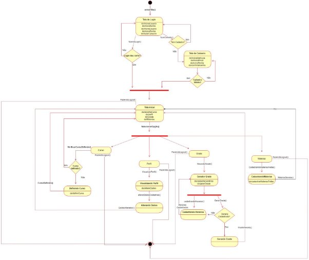
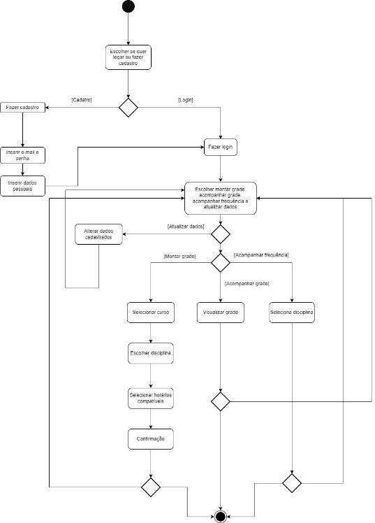
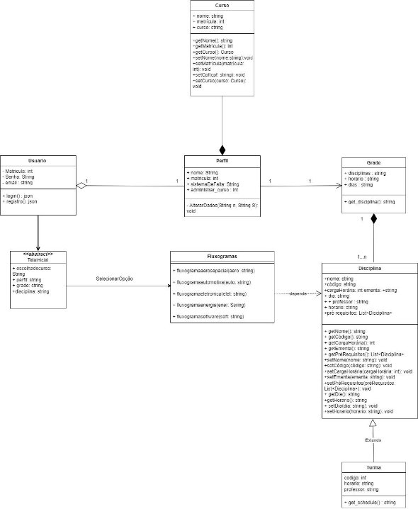
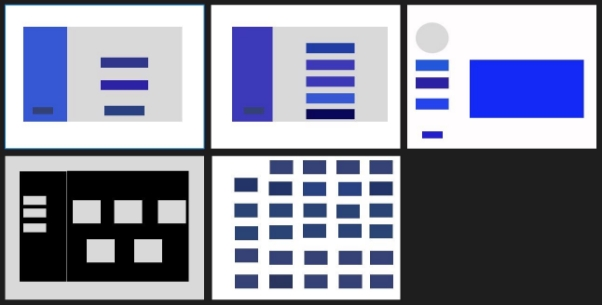
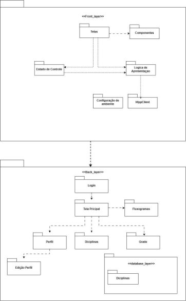

**Documento de Arquitetura**

Versão [1.1]

**Histórico de Revisão**

|**Data**|**Versão**|**Descrição**|**Autor(es)**|
| - | - | - | - |
|**01/11/2023**|1\.0|Criação do Documento de arquitetura.|Grupo Kepler|
|**30/11/2023**|1\.1|Correção na formatação do texto.|Johnny da Ponte|

Autores:

| **Matrícula** | **Nome** | **Descrição do papel assumido na equipe** | **% de contribuição ao trabalho (\*)** |
| - | - | - | - |
| **211063111** | Gustavo Alves de Souza | Documentação e Backend | 20% |
|**190110066**|Johnny da Ponte Lopes|Documentação e Banco de Dados|20%|
|**200032364**|Vitor Gabriel Gonçalves Dias|Diagramas e Backend|20%|
|**180132466**|Vitor Pereira Bessa|Banco de Dados|10%|
|**211061743**|GABRIEL FENELON ROCHA GONCALVES|Documentação e Frontend|15%|
|**211061897**|IGOR DE SOUSA JUSTINO|Diagramas e Frontend|15%|

**1 Introdução**

1.1**Propósito**

Este documento descreve a arquitetura do sistema sendo desenvolvido pelo grupo kleper, na disciplina de MDS – Métodos de Desenvolvimento de Software – edição do segundo semestre de 2023, Gerenciador acadêmico, a fim de fornecer uma visão abrangente do sistema para desenvolvedores, testadores e demais interessados.

1.2 **Escopo**

O detalhamento do escopo se encontra no documento Declaração de Escopo do Produto Kepler. Porém, em linhas gerais o escopo do produto compreende em um software que realizará :

- Cadastro e Autenticação: Os alunos podem se cadastrar e fazer login de forma segura, garantindo a proteção de suas informações pessoais.
- Atualização do Status das Disciplinas: Os alunos podem atualizar o status de suas disciplinas, indicando se já as concluíram com êxito, se estão atualmente matriculados ou se ainda não cursaram a disciplina.
- Acompanhamento do Progresso Acadêmico: Os alunos têm à disposição uma ferramenta que lhes permite acompanhar seu progresso acadêmico visualizando as disciplinas já finalizadas e aquelas que ainda precisam ser cursadas.
- Gerador de Grades: O sistema inclui um gerador de grades que com base em informações fornecidas pelo aluno, como sua disponibilidade de horários e as disciplinas já concluídas, irá gerar uma grade com opções de disciplinas disponíveis para o aluno realizar a matrícula.
- Gerenciador de faltas: Os alunos poderão realizar o acompanhamento e atualização de suas faltas nas disciplinas que estejam cursando.

O desenvolvimento é guiado pelo pela metodologia ágil e orientado por scrum 

**2 Representação Arquitetural**

2.1 **Definições**

O sistema seguirá uma arquitetura Model-View-Controller (MVC).

1.2 **Justifique sua escolha.**

A escolha da arquitetura Model-View-Controller (MVC) para o projeto é justificada pela sua eficácia comprovada na organização e separação de preocupações em sistemas complexos. O Django, o framework em uso, é projetado para facilitar a implementação do padrão MVT (uma variação do MVC), o que torna a adoção dessa arquitetura uma escolha natural.

Ao seguir a abordagem MVC, a equipe poderá manter uma clara distinção entre a representação dos dados (Model), a lógica de apresentação e interação com o usuário (View), e a lógica de controle e manipulação de dados (Controller). Essa separação permitirá uma manutenção mais eficiente, facilitando a implementação de novos recursos, a correção de bugs e a escalabilidade do sistema.

Além disso, a abordagem MVC se alinha com os princípios de boas práticas de desenvolvimento de software, promovendo a reutilização de código, a modularidade e a testabilidade. Isso contribui para um código mais limpo, organizado e de fácil compreensão, o que é essencial para o sucesso e a longevidade do projeto.

2.3 **Detalhamento**

*.*

2.4 **Metas e restrições arquiteturais**

**O sistema deve responder a 95% das consultas em até 2 segundos:**

**Explicação:** Estabelecer um tempo de resposta de 95% das consultas em até 2 segundos é crucial para oferecer uma experiência ágil e responsiva aos usuários. Isso se traduz em fornecer informações de forma rápida e eficiente, mantendo os usuários engajados e satisfeitos com a usabilidade do sistema. Uma resposta rápida é fundamental para a eficácia e funcionalidade do sistema, pois os usuários dependem da agilidade na navegação e interação com o aplicativo.

**Conformidade com padrões de segurança:**

**Explicação:** É super importante garantir que implementemos boas práticas de segurança de forma eficaz. Isso ajuda a proteger os dados e a manter a confiança dos usuários no nosso sistema. Ao focarmos na segurança dos dados, mostramos que levamos a sério a proteção das informações. Além disso, ao ficarmos por dentro das últimas novidades em segurança, garantimos que nosso sistema esteja sempre bem protegido contra possíveis ameaças e problemas.

**Usabilidade:**

**Explicação:** Nosso objetivo é projetar uma interface que seja fácil de usar e agradável para os usuários. Queremos garantir que a experiência de navegação seja intuitiva, permitindo que os usuários se familiarizem rapidamente com o sistema. Ao focarmos na usabilidade, estamos priorizando a comodidade do usuário e buscando proporcionar uma experiência de uso fluida e positiva. Isso significa que cada elemento da interface será cuidadosamente pensado para tornar a interação o mais intuitiva e amigável possível, visando facilitar a realização das tarefas e promover a satisfação dos usuários com o nosso sistema.

**Restrição de Matrícula UnB:**

**Explicação:** A restrição para matrículas correspondentes à UnB, contendo 9 dígitos, é essencial para garantir a validade e a conformidade dos registros dos estudantes. Ao impor essa restrição, asseguramos que apenas matrículas da Universidade de Brasília (UnB) sejam inseridas no sistema, evitando a inclusão de informações incorretas ou inválidas.

**Restrição de Seleção de Grade Única:**

**Explicação:** A restrição para que o usuário possa prosseguir com apenas uma grade selecionada é estabelecida visando manter a clareza e a coerência na definição dos horários e disciplinas cursadas pelo estudante. Essa limitação garante que cada usuário mantenha uma grade específica, o que simplifica a organização e a gestão de disciplinas.

**Restrição de Horários de Disponibilidade do Estudante:**

**Explicação:** Esta restrição delimita os horários em que o estudante pode definir sua disponibilidade para realizar disciplinas. Ao restringir os horários disponíveis para a seleção de matérias, garante-se que o sistema sugira disciplinas que se encaixem nos intervalos de tempo escolhidos pelo aluno. Isso assegura uma sugestão de disciplinas que sejam realmente viáveis para o estudante, considerando sua agenda. Essa restrição tem a finalidade de proporcionar ao aluno recomendações mais precisas e alinhadas às suas necessidades, evitando sugestões fora de seus horários disponíveis para estudo.

2.5 **Visão de Casos de uso (escopo do produto)**

O software possibilitará aos usuários realizar o processo de cadastro e login. Após o login, os usuários poderão selecionar o curso oferecido pela Faculdade do Gama (FGA) que estão atualmente cursando, bem como registrar as matérias que já concluíram. Com base nesses dados, o sistema permitirá que os estudantes montem uma grade horária personalizada. Para esse fim, o sistema solicitará informações sobre os horários disponíveis para cada estudante e, em seguida, gerará uma grade com opções de disciplinas, levando em consideração as matérias já concluídas e a disponibilidade de horários dos alunos.

Adicionalmente, os alunos terão a capacidade de visualizar seu perfil no sistema, onde encontrarão informações sobre as disciplinas e seu progresso acadêmico.

2.6 **Visão lógica**

**Diagrama de estados da aplicação**

Estados: Cada retângulo com bordas arredondadas representa um estado, que pode ou não conter ações e atividades internas a serem executadas quando o objeto se encontra no estado em questão. Por exemplo, o estado da 'Tela de Login'.

Eventos: Representam cada ação que provoca uma alteração no estado em questão. Por exemplo, com base na ação executada pelo usuário na ‘Tela de Login’, isso pode resultar na transição do estado ‘Tela de Login’ para ‘Tela de Cadastro’ ou acionar uma verificação de login.

Transição: É a troca de estado. Exemplo: A troca de estado ‘Tela de Login’ à ‘Tela de Cadastro’.

Decisão: Diamantes são usados para representar decisões. Por exemplo, caso o usuário não faça o login corretamente, voltará para a tela de Login, caso consiga com sucesso, irá para a ‘Tela de Inicial’.

**Diagrama de atividades da aplicação**

Atividades: Cada etapa do processo é representada por um retângulo com bordas arredondadas. Por exemplo, "Fazer login" e "Selecionar disciplinas" são atividades. Decisões: Diamantes são usados para representar decisões. Por exemplo, após a autenticação, pode haver uma decisão sobre para onde o usuário será redirecionado com base em seu perfil.

Fluxos de Controle: Linhas direcionais conectam as atividades, mostrando a sequência de execução. Por exemplo, após a autenticação bem-sucedida, o fluxo segue para o Dashboard do Aluno.

**Diagrama de classes:**

2.7 **Visão de Implementação**

**Wireframe - Prototipagem de Baixa Fidelidade:**

**Diagrama de pacotes:**

**Lógica de Negócios:**

**Matrícula eficiente:** Este sistema se baseia em uma lógica para orientar os estudantes na escolha de disciplinas com base em seu curso, disponibilidade de horários e exigências curriculares. A lógica de matrícula garante que as sugestões de disciplinas sejam feitas de maneira inteligente e eficiente.

**Sugestão de disciplinas:** A lógica estabelece a forma como o sistema sugere disciplinas que se encaixam nos horários disponíveis do estudante, evitando conflitos e garantindo uma seleção que atenda às preferências e disponibilidades individuais.

**Acompanhamento de progresso acadêmico:** Define como o sistema exibirá as disciplinas já concluídas, os créditos obtidos e a frequência do estudante. Essa lógica ajuda na visualização do progresso acadêmico do usuário.

**Regras de Negócios:**

**Restrição de matrícula UnB:** Esta regra garante que apenas matrículas correspondentes à Universidade de Brasília (UnB), identificadas por um formato específico de 9 dígitos, sejam aceitas no sistema. Isso assegura a validade e a conformidade dos registros dos estudantes.

**Restrição de seleção de grade única:** Limitada o usuário a manter apenas uma grade selecionada, assegurando uma organização clara e coerente na definição dos horários e disciplinas cursadas. Isso simplifica a gestão das disciplinas e evita duplicidades ou conflitos de dados.

**Comunicação com o banco de dados:**

**Recuperar Dados:** A aplicação precisará buscar informações do banco de dados, como detalhes das disciplinas, horários, professores, matrículas dos alunos e outras informações acadêmicas relevantes.

**Salvar Dados:** Deve ser capaz de enviar dados para o banco de dados, como novas matrículas, alterações nas grades, informações de novos projetos de extensão e atualizações de progresso acadêmico.

**Atualizar Dados:** É necessário poder modificar ou atualizar informações existentes, como alterar o status de uma disciplina, registrar o progresso do aluno ou atualizar as informações do usuário.

**Excluir Dados:** A aplicação também pode exigir a capacidade de remover ou desativar informações antigas ou desnecessárias, por exemplo, remover um projeto de extensão.

A maneira como essa comunicação é realizada é geralmente via consultas ou instruções específicas à linguagem de consulta do banco de dados, como SQL. Normalmente, uma camada de acesso a dados é usada para interagir com o banco de dados, permitindo que o software se comunique de forma eficiente e segura.

Esta comunicação deve ser segura, confiável, eficiente e capaz de lidar com possíveis erros, como falhas na conexão ou consultas mal formadas. Além disso, deve ser capaz de tratar adequadamente questões de segurança, como prevenção de injeção de SQL e proteção de dados confidenciais dos estudantes.

2.8 **Visão de Implantação**

**Infraestrutura de Hardware para a Implantação:**

O software será implantado em uma infraestrutura baseada em nuvem, utilizando serviços de hospedagem oferecidos por provedores confiáveis, como AWS (Amazon Web Services), Google Cloud ou Azure da Microsoft. Esta escolha é justificada pela escalabilidade oferecida por esses provedores, permitindo ajustar os recursos conforme a demanda do software aumenta.

A arquitetura será distribuída em servidores de aplicativos e servidores de banco de dados. A distribuição desses servidores permitirá um desempenho escalável e estável para o software de gerenciamento acadêmico, garantindo também tolerância a falhas e segurança dos dados dos alunos.

**Tecnologias de Implementação:**

O front-end do sistema será desenvolvido com React, uma biblioteca JavaScript amplamente usada para criar interfaces de usuário eficientes. No back-end, a aplicação será baseada em Django, um framework robusto e altamente seguro para a construção de aplicativos web.

**Banco de Dados:**

Para o banco de dados, optamos pelo MySQL devido à sua confiabilidade e desempenho, sendo uma escolha sólida para sistemas que exigem robustez e escalabilidade. O MySQL oferece recursos de segurança avançados, garantindo a integridade e a confidencialidade dos dados dos alunos.

A justificativa para essa escolha é baseada na ampla aceitação e suporte da comunidade, bem como na familiaridade da equipe de desenvolvimento com essa tecnologia. A capacidade do MySQL de lidar com grande volume de dados e a sua escalabilidade vertical e horizontal são fatores determinantes para a escolha como o banco de dados para o sistema de gerenciamento acadêmico.

2.9 **Restrições adicionais**

**Restrições adicionais ao software:**

1. **Acesso Restrito via Login:**

O software será acessível via Internet, porém, para garantir a segurança e a confidencialidade dos dados dos estudantes, exigirá a autenticação do usuário através de login. Isso é essencial para controlar o acesso e garantir que apenas usuários autorizados possam interagir com o sistema. A autenticação fornecerá uma camada adicional de segurança, protegendo as informações sensíveis dos alunos.

2. **Capacidade de Usuários Concomitantes:**

O software será projetado para atender a uma capacidade de, por exemplo, mil usuários logados simultaneamente. Isso é necessário para garantir que, mesmo em horários de alta demanda, como épocas de matrículas, o sistema seja capaz de lidar com um grande número de usuários sem afetar o desempenho ou a disponibilidade. A escalabilidade é crucial para manter a usabilidade e a eficiência do sistema.

**Características de Qualidade Relevantes para o Software:**

1. **Usabilidade:**

A interface do usuário será projetada levando em consideração a usabilidade e a experiência do usuário (UX). Isso implica em um design intuitivo, fácil de usar e navegar. Essa abordagem focada no usuário é essencial para garantir que os estudantes possam interagir com o sistema de forma eficiente e sem dificuldades.

2. **Confiabilidade:**

A confiabilidade do software é fundamental. Isso implica na garantia de que o sistema funcione sem falhas ou erros significativos. A confiabilidade é essencial para manter a integridade dos dados e fornecer um serviço consistente aos estudantes.

3. **Segurança:**

A segurança dos dados dos alunos é uma prioridade. O software adotará práticas de segurança robustas, como criptografia de dados, controles de acesso e conformidade com regulamentações de proteção de dados para garantir a segurança das informações armazenadas no sistema.

4. **Portabilidade:**

O sistema será projetado para ser altamente portável, permitindo que os usuários acessem o software em vários dispositivos, como computadores, tablets e smartphones. Isso é essencial para garantir a acessibilidade e a conveniência para os estudantes, independentemente do dispositivo que estão utilizando.

5. **Desempenho:**

O desempenho do software será monitorado para garantir a responsividade do sistema. Isso inclui a otimização de consultas ao banco de dados, minimização do tempo de resposta e carregamento rápido das páginas. A manutenção de um desempenho ágil é crucial para a satisfação dos usuários.

**3 Bibliografia**

*MICKAELT. **O que é padrão MVC? Entenda arquitetura de softwares! | Le Wagon**. Disponível em: <https://blog.lewagon.com/pt-br/skills/o-que-e-padrao-mvc/#:~:text=O%20MVC%20%C3%A 9%20uma%20sigla>.*
*